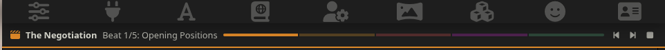
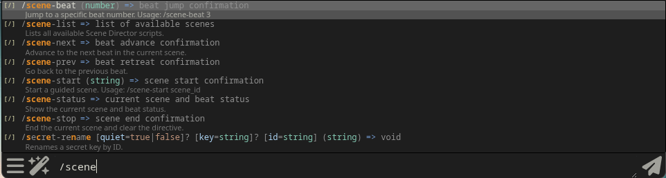

# Scene Director

A [SillyTavern](https://github.com/SillyTavern/SillyTavern) extension that guides roleplay scenes through structured narrative beats. Define a scene as a sequence of beats — each with a directive, tone, and phase — and Scene Director injects them into the AI's context as you progress through the story.

## Features

- **Beat-based scene control** — Navigate forward, backward, or jump to any beat
- **Phase-aware prompts** — Five default narrative phases with built-in guidance, or define custom phases per scene with your own prompts and colors
- **Per-chat state** — Scene progress is saved per chat; switching chats preserves your place and restores automatically when you return
- **Chat banner** — Persistent bar above the chat showing scene title, current beat, phase progress, and quick navigation controls
- **Wand menu button** — Clapperboard icon in the extensions menu highlights when a scene is active, with beat counter
- **Visual progress bar** — Color-coded phase segments show where you are in the scene
- **Configurable injection depth** — Control how many messages back the beat directive is placed in context
- **Scene import/delete** — Import your own scene JSON files through the UI or slash commands; delete imported scenes when no longer needed
- **Slash commands** — Full control from the chat input
- **Advance hints** — Optional hints for when to move to the next beat

## Installation

### Via SillyTavern Extension Installer

Use the install URL:
```
https://github.com/Ollec/SillyTavern-SceneDirector
```

### Manual Installation

Clone into SillyTavern's third-party extensions directory:

```bash
cd SillyTavern/public/scripts/extensions/third-party/
git clone https://github.com/Ollec/SillyTavern-SceneDirector.git
```

Restart SillyTavern and enable the extension.

## Usage

### UI Controls

**Extensions Drawer** — Open the **Scene Director** panel in the extensions sidebar. Select a scene from the dropdown and press play. Use the Prev/Next/Stop buttons to navigate beats. The drawer also has settings for advance hints and injection depth.

**Chat Banner** — When a scene is active, a banner appears at the top of the chat area showing the scene title, current beat label, and a color-coded phase progress bar. The banner includes Prev/Next/Stop buttons for quick navigation without opening the drawer.



**Wand Button** — The clapperboard icon in the extensions menu shows the current beat count (e.g., "2/5") during an active scene. Click it to open the Scene Director drawer.

### Settings

| Setting | Default | Description |
|---------|---------|-------------|
| Show advance hints | On | Display hints about when to move to the next beat |
| Injection depth | 1 | How many messages back the beat directive is placed in context (0 = end of context) |

### Slash Commands

| Command | Description |
|---------|-------------|
| `/scene-list` | List all available scenes |
| `/scene-start <id>` | Start a scene by ID |
| `/scene-next` | Advance to the next beat |
| `/scene-prev` | Go back one beat |
| `/scene-beat <n>` | Jump to beat number n |
| `/scene-status` | Show current scene and beat info |
| `/scene-stop` | End the current scene |
| `/scene-import` | Import a scene file (opens file picker, or pass inline JSON) |
| `/scene-delete <id>` | Delete an imported scene by ID (with confirmation) |



## Creating Scenes

Scenes are JSON files with a title and an array of beats — each with a directive, tone, and narrative phase. You can import scene files through the **Import Scene** button in the extensions drawer or via the `/scene-import` slash command. Scene Director also ships with a bundled sample scene.

See the full **[Scene Creation Guide](docs/creating-scenes.md)** for details on writing directives, using phases, and structuring beats. A sample scene is included at [scenes/the_negotiation.json](scenes/the_negotiation.json).

## Development

### Running Tests

```bash
cd tests
pnpm install
pnpm test
```

### Project Structure

```
├── index.js                 # SillyTavern integration layer
├── docs/images/             # Screenshots for README
├── src/
│   └── sceneManager.js      # Pure logic (testable, no ST dependencies)
├── director.html            # UI template (drawer, banner, wand button)
├── style.css                # Styling
├── scenes/
│   ├── manifest.json        # Bundled scene registry (seeds first-run)
│   └── the_negotiation.json # Bundled sample scene
├── tests/
│   ├── sceneManager.test.js # Unit tests (Jest)
│   └── stCompat.test.js     # Static compatibility tests against ST source
├── .github/workflows/
│   └── test.yml             # CI pipeline
└── manifest.json            # ST extension metadata
```

## License

MIT
